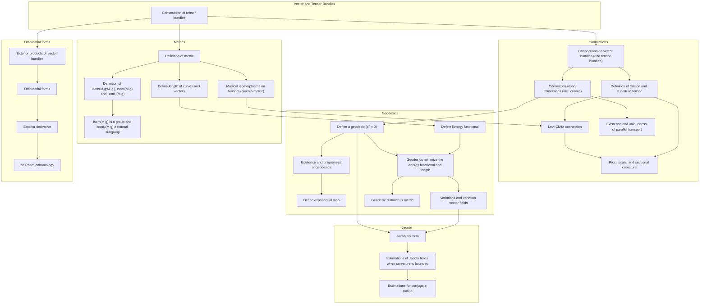

# A Gap Analyis for Riemannian Geometry

To make any statements about (Pseudo-)Riemannian Geometry, many structures and propositions need to be established in Mathlib. On this page we give an oppiniated overview about topics which often occur in Riemannian Geometry and about the current state in Mathlib.

A few things to note:
* The analysis focuses on real manifolds, though most statements can be made over a general NontriviallyNormedField.
* Some parts may not work for Pseudo-Riemannian geometries
* The description is not mathematically precise, it should just give an idea of the topic
* Many interesting topics are missing - but we have to start somewhere

## Curves and submanifolds

Typical constructions for curves and submanifolds are:
1. Differential curves vs. piece-wise differential curves
1. Length of curves (requires metric)
1. Differentiation along curves ("velocity")
1. Immersions of submanifolds, i.e. smooth maps `N -> M` where the derivative has maximal rank / is injective
1. Construction of vector fields along curves and immersions, for example:
    1. normal vector fields (requires metric)
    1. projection onto the tangent space of `N` (requires metric)
    1. parallel vector fields along `N` (requires connection)
1. Variations of curves, especially geodesics; variations per se are simply immersions of `[0, 1] x [0, 1]` or similar. For geodesic variations, metric and connection is required

## Vector bundles and tensor bundles

Here, we refer only to vector bundles, not to principal fibre bundles etc. For example, we wouldn't be able to define Chern classes, Yang-Mills, Ehresmann connections etc.

Most vector bundles in Riemannian are actually tensor bundles of the tangent bundle and many objects are usually viewed as sections in tensor bundles of the tangent bundle (aka tensors).

Examples for such objects are:
1. The metric is a section in the (0, 2) tensor bundle of TM
1. The curvature tensor is a section in the (1, 3) tensor bundle
1. The Ricci tensor is also a (0, 2) tensor
1. The curvature tensor for the Levi-Civita connection is sometimes also seen as a (2, 2) or (0, 4) tensor. For example `R(X ∧ Y) = Z ∧ W`, which is a symmetric, bilinear form on the exterior product `TM ∧ TM`.
1. A function can be seen as a (0, 0) tensor
1. A vector field is a (1, 0) tensor
1. The torsion of a connection is a (1, 2) tensor
1. Differential forms are alternating (0, k) tensors, or alternatively sections in the exterior product of the tangent bundle.

We also have vector bundles in the theory of submanifolds:
1. Vector fields along immersions `i: N -> M` can be seen as sections in the bundle over `N` with fibre `T_i(p) M`
1. If we have a metric, we can project `TM` to `TN` and define the normal bundle with base `N` and the fibres are the vector space orthogonal to `TN` in `TM`.

Topics to cover:
1. Construction of the (k, l) tensor bundle from another vector bundle (probably only used for tensor bundles from `TM`, but can be generalized)
1. Define exterior product of vector bundles - either repeating the process for tensor bundles, or by defining it as a sub bundle of the tensor bundle.
1. Define sub bundle, for example to define the immersed tangent bundle of a submanifold or the normal bundle. Maybe a statement that the kernel of a pointwise linear map of the fibre to "something" creates a subbundle. This could be used to define exterior products and symmetric products.
1. Contractions / traces and similar constructions on tensors.
1. Define a metric on tensor products

## Linear Connections

The most important connection on (Pseudo-) Riemannian manifolds is the Levi-Civita connection, but for example in the theory of homogeneous spaces there are other linear connections, such that all left invariant vector fields along curves are parallel.

Connections are also used for submanifolds, like the normal connection which is used in the formulation of the Gauss-Codazzi equations.

Any connection on `TM` induces a connection on the tensor bundles. This is used for the derivative of the curvature tensor, Ricci tensor or the second fundamental form (parallel submanifolds).

So, topics to look at are:
1. Definition of linear connections on arbitrary vector bundles, including bundles over immersions.
1. Definition of curvature of linear connections and torsion of affine connections.
1. Define parallel sections / parallel transport on vector bundles, prove existence and uniqueness (Picard-Lindeloff in coordinates).
1. Special case affine connection on `TM`
1. A connection on a vector bundle induces a unique connection on the tensor bundles.
1. Levi-Civita connection as unique affine connection which has no torsion and where the metric (0, 2) tensor is parallel.
1. Definition of curvature : curvature tensor, Ricci, scalar curvature, sectional curvature on planes

## Geodesics and exponential map

This part requires metrics and connections.

* Define a geodesic as having zero second derivative
* Existence, uniqueness of geodesics (Picard-Lindeloff)
* Define exponential map
* Describe length of a curve, geodesic variations, action / Energy of the curve
* Prove that geodesics are minimizing
* Geodesic distance is a metric

## Curvature and Geodesics

* Define variation vector fields (=> Jacobi fields)
* Prove Jacobi formula `J''(t) = R(J(t), c'(t)) c'(t)`
* Estimations for Jacobi fields in presence of upper / lower bounds for curvature?
* Statements about the injectivity radius

## Differential forms & de Rham cohomology

If we have the exterior product of vector bundles defined, we can introduce differential forms and the derivative:

* Define the space of differential forms and proof structural results (module over differentiable functions)
* Define exterior derivative of differential forms (axiomatic approach)
* Proof `d d = 0`
* Define de Rham cohomology
* State the theorem of de Rham (probably no proof...)

## Isometries and Lie groups

Though a generic manifold has no isometries, many interesting examples have many isometries or are even homogeneous.

A few topics:
* Define an isometry and the isotropy at a point
* Proof that Isom(M) is a group (not a Lie group, yet)
* Proof that Isom(M) is a Lie group.
* Construct differentiable structure on quotients (such that the projection becomes a submersion)
* Construct metric on the quotient (assuming the total space has a metric)
* Proof that G/H becomes a Riemannian manifold if H compact and G carries an appropriate left invariant metric.
* Define S^n, CP^n, HP^n with Fubini-Studi metric as first example of symmtric spaces.

## Dependency diagram

